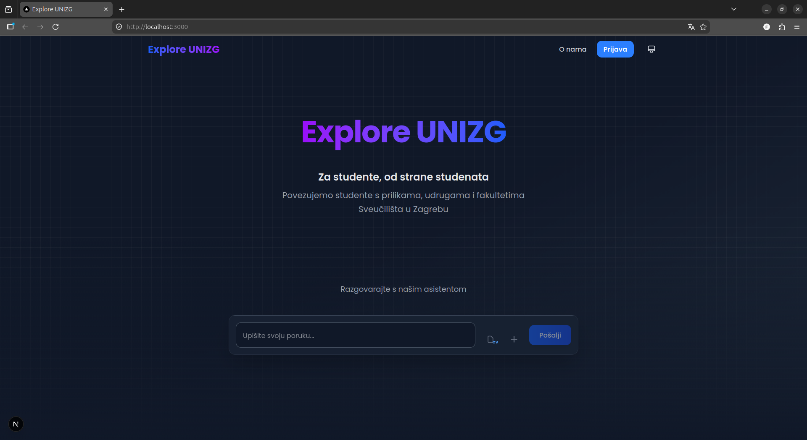
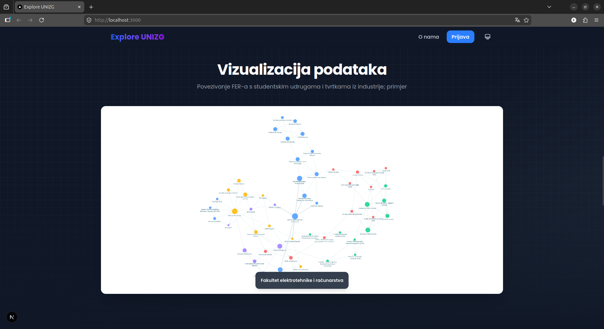

# Explore UNIZG

**Za studente, od strane studenata** — connecting University of Zagreb students with faculties, student organizations, and career opportunities through AI-powered matching and interactive network visualization.

Built at a hackathon by team **pitfa19**.






> [View the presentation on Canva](https://canva.link/c83lpq5i7afl6to)

## What It Does

Explore UNIZG helps students discover where they belong at the University of Zagreb. You chat with an AI assistant about your interests, skills, and goals — and it places you on an interactive graph alongside 30+ faculties and student organizations, showing you which ones are the best match.

### Key Features

- **AI Chat Assistant** — Conversational interface powered by GPT-4.1 with web search. Supports Croatian and English. Ask about programs, career paths, student clubs, or anything UNIZG-related.
- **Interactive Network Graph** — Faculties and organizations visualized as a force-directed graph using [Reagraph](https://reagraph.dev). Nodes are colored by cluster, sized by connectivity. Click any node to explore its details and neighbors.
- **Student-to-Faculty Matching** — After chatting, your conversation is embedded into vector space and matched against faculty/organization embeddings using K-Nearest Neighbors (cosine distance). Your top 3 matches are highlighted on the graph.
- **Faculty & Organization Explorer** — Browse detailed profiles of UNIZG faculties (programs, research topics, technologies, labs) and student organizations (missions, activities, projects, partnerships).
- **Events & Jobs** — Discover career fairs, hackathons, workshops, and job listings relevant to students.

## Tech Stack

| Layer | Technology |
|-------|-----------|
| **Backend** | Django 5.2, Python 3.12, SQLite |
| **Frontend** | Next.js 16, React 19, Tailwind CSS 4 |
| **AI** | OpenAI GPT-4.1 (chat), text-embedding-3-small (embeddings) |
| **Graph** | Reagraph (WebGL-based network visualization) |
| **Animations** | Motion (Framer Motion) |

## Project Structure

```
explore_unizg/
├── backend/
│   ├── graph_integration/       # Faculty & organization models, graph API
│   ├── openai_integration/      # Chat, embeddings, student models
│   ├── scripts/                 # Data upload scripts
│   ├── data/                    # JSON datasets (faculties, orgs, clusters, edges)
│   ├── settings.py
│   ├── urls.py
│   └── cors_middleware.py
├── frontend/
│   ├── app/                     # Next.js app router (pages, layout)
│   ├── components/
│   │   └── home/
│   │       ├── ChatSection.jsx       # AI chat interface
│   │       ├── NetworkGraph.jsx      # Interactive graph canvas
│   │       ├── FakultetiList.jsx     # Faculty browser
│   │       ├── UdrugeList.jsx        # Organization browser
│   │       └── EventsSlideshow.jsx   # Events carousel
│   └── lib/api/                 # API client functions
└── README.md
```

## API Endpoints

| Method | Endpoint | Description |
|--------|----------|-------------|
| `POST` | `/api/message/` | Send a chat message, get AI reply |
| `POST` | `/api/embed-student/` | Generate student embedding & find KNN matches |
| `GET` | `/api/faculties/edges/` | Get all graph nodes & edges |
| `GET` | `/api/faculties/get/` | Get faculty details + related items |
| `GET` | `/api/organisations/get/` | Get organization details |
| `GET` | `/api/info/` | Stats (faculty/org/student counts) |

## Getting Started

### Prerequisites

- Python 3.12+
- Node.js 18+
- An [OpenAI API key](https://platform.openai.com/api-keys)

### Backend Setup

```bash
cd backend
python -m venv .venv
source .venv/bin/activate
pip install -r requirements.txt

# Create .env
cat > .env << 'EOF'
DJANGO_SECRET_KEY=<generate-a-secret-key>
DJANGO_DEBUG=True
DJANGO_ALLOWED_HOSTS=localhost,127.0.0.1
OPENAI_API_KEY=<your-openai-key>
EOF

python manage.py migrate
python manage.py runserver
```

> To generate a Django secret key: `python -c "from django.core.management.utils import get_random_secret_key; print(get_random_secret_key())"`

### Frontend Setup

```bash
cd frontend
npm install

# Create .env.local
echo "NEXT_PUBLIC_BACKEND_URL=http://localhost:8000" > .env.local

npm run dev
```

The frontend runs at `http://localhost:3000`, backend at `http://localhost:8000`.

### Loading Data

Faculty and organization datasets are in `backend/data/`. Use the upload scripts to populate the database:

```bash
cd backend
python scripts/main.py              # Upload faculties
python scripts/upload_organisations.py  # Upload organizations
```

## How the Matching Works

1. A student chats with the AI assistant about their interests and goals
2. The full conversation is sent to OpenAI's `text-embedding-3-small` model to generate a vector embedding
3. This embedding is compared against pre-computed faculty and organization embeddings using L2-normalized cosine distance
4. The top 3 nearest neighbors are returned and the student node is placed on the graph with edges to their matches
5. Second-degree connections (neighbors of neighbors) are also shown for broader exploration

## License

This project was built at a hackathon and is provided as-is for educational purposes.
